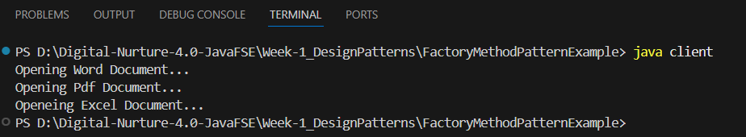

# 🏗️ Factory Method Pattern – Java Implementation

> ✨ **Digital Nurturing – Java SRE**  
> 📅 **Week 1** – *Design Patterns Assignment*  
> 🔍 Pattern Focus: **Factory Method**

---

## 📘 Overview

This project demonstrates the **Factory Method Design Pattern** in Java through a document management system that supports dynamic creation of Word, PDF, and Excel documents.

The goal is to show how the **creation logic** is encapsulated using factories, promoting **loose coupling** and **scalability**.

---

## 🎯 Design Pattern Explained

The **Factory Method Pattern** defines an interface for creating an object but lets subclasses decide which class to instantiate. It allows a class to delegate the responsibility of instantiating its dependencies.

> 🧱 “Create objects without exposing the instantiation logic to the client.”

---

## 📂 Project Structure

```
FactoryMethodPatternExample/
├── document/
│   ├── Document.java
│   ├── WordDocument.java
│   ├── PdfDocument.java
│   └── ExcelDocument.java
├── factory/
│   ├── DocumentFactory.java
│   ├── WordDocumentFactory.java
│   ├── PdfDocumentFactory.java
│   └── ExcelDocumentFactory.java
└── test/
    └── client.java
```

> 📌 Files are organized by **responsibility**: core interfaces, factories, and test client.

---

## 🧩 Class Responsibilities

| Class/File                  | Role                                                         |
|----------------------------|--------------------------------------------------------------|
| `Document` *(interface)*   | Declares `open()` method                                     |
| `WordDocument`             | Implements `Document` with Word-specific logic               |
| `PdfDocument`              | Implements `Document` with PDF-specific logic                |
| `ExcelDocument`            | Implements `Document` with Excel-specific logic              |
| `DocumentFactory` *(abstract)* | Declares `createDocument()` method                        |
| `WordDocumentFactory`      | Instantiates `WordDocument`                                  |
| `PdfDocumentFactory`       | Instantiates `PdfDocument`                                   |
| `ExcelDocumentFactory`     | Instantiates `ExcelDocument`                                 |
| `client.java`              | Acts as the test driver for the pattern                      |

---

## 🛠️ How to Compile & Run

### ⏬ Step 1: Compile
```bash
javac document/*.java factory/*.java test/*.java
```

### ▶️ Step 2: Run
```bash
java test.client
```

---

## ✅ Expected Output

```
Opening Word Document...
Opening PDF Document...
Opening Excel Document...
```

---

## 🖼️ Screenshot of Output

> 📷 *(Insert your screenshot below)*  


---

## 🚀 Key Learnings

- 📦 Separation of concerns using **interfaces and abstract classes**
- 🔄 Swappable components using **concrete factory classes**
- 💡 Clean implementation of the **Factory Method Pattern**
- 🧠 Reusable object creation logic without violating OOP principles

---

## 🙋 Author

| Name         | Track                      | Week | Pattern Used           |
|--------------|----------------------------|------|------------------------|
| G.P. Sachin  | Digital Nurturing – Java SRE | 1    | Factory Method Pattern |

---

## 📎 Useful Resources

- [Java Design Patterns (Baeldung)](https://www.baeldung.com/java-creational-design-patterns)
- [Refactoring.Guru – Factory Method](https://refactoring.guru/design-patterns/factory-method)
- [GeeksForGeeks – Design Patterns in Java](https://www.geeksforgeeks.org/design-patterns-set-1-introduction/)

---

> 🔖 *This README is designed for maximum readability and professional presentation on GitHub. Use it to demonstrate clean design pattern implementation during reviews and assessments!*
