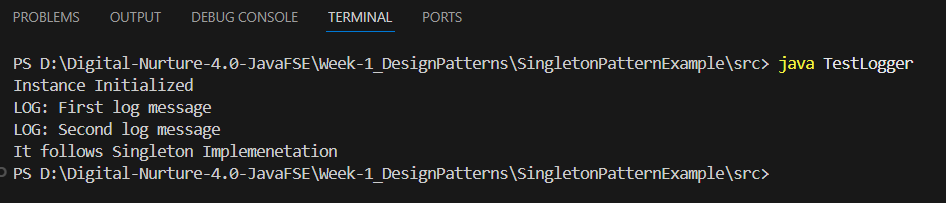

# 🔒 Singleton Pattern – Java Implementation

> ✨ **Digital Nurturing – Java SRE**  
> 📅 **Week 1** – *Design Patterns Assignment*  
> 🔍 Pattern Focus: **Singleton**

---

## 📘 Overview

This project demonstrates the **Singleton Design Pattern** in Java.  
The Singleton pattern ensures that **only one instance** of a class is created and provides a **global access point** to that instance.

Use-case implemented: A **Logger class** where all logs throughout the app are handled by a single instance.

---

## 🎯 Design Pattern: Singleton

The **Singleton Pattern** restricts instantiation of a class to one object.  
This is useful when exactly one object is needed to coordinate actions across the system.

> 🧠 Ensures **single point of control** over a shared resource.

---

## 🧩 Class Responsibilities

| Class/File       | Role / Responsibility                                   |
|------------------|---------------------------------------------------------|
| `Logger.java`    | Implements the Singleton pattern, provides a single instance and logging logic |
| `Main.java`      | Test class to demonstrate Singleton behavior            |

---

## 📂 Folder Structure

```
SingletonPatternExample/
├── Logger.java
└── Main.java
```

> 📌 All files are in the **default package** for simplicity.

---

## 🛠️ How to Compile & Run

### ⏬ Step 1: Compile
```bash
javac *.java
```

### ▶️ Step 2: Run
```bash
java Main
```

---

## ✅ Expected Output

```
Logging from Singleton instance.
Logger instance: Logger@6d06d69c
Logging again from the same Singleton instance.
Logger instance: Logger@6d06d69c
```

> ✅ Note: Both logs show the same instance address → proves Singleton pattern works.

---

## 🖼️ Screenshot of Output

> 📷 *(Insert your screenshot below)*  


---

## 🚀 Key Learnings

- Implemented **thread-safe Singleton** using private constructor and static method
- Ensured **single instance creation**
- Used `getInstance()` to control access
- Reinforced OOP principle of **encapsulation**

---

## 🙋 Author

| Name         | Track                      | Week | Pattern Used     |
|--------------|----------------------------|------|------------------|
| G.P. Sachin  | Digital Nurturing – Java SRE | 1    | Singleton Pattern |

---

## 📎 Useful Resources

- [Refactoring.Guru – Singleton](https://refactoring.guru/design-patterns/singleton)
- [GeeksForGeeks – Singleton Class in Java](https://www.geeksforgeeks.org/singleton-class-java/)
- [Baeldung – Singleton in Java](https://www.baeldung.com/java-singleton)

---

> 🧑‍💻 *This README helps demonstrate Singleton Design Pattern clearly for assessment and reviews.*
